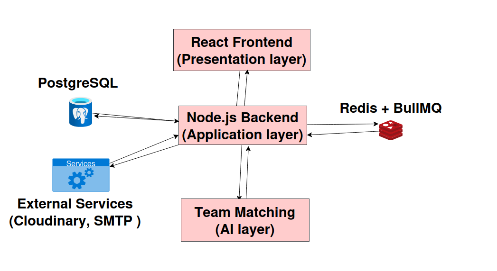

# Team Catalyst System Overview

## Overview
Hackathons are no longer just competitions, they have become a
critical driver of innovation for both students and companies.
This is clearly reflected in their rapid global growth, jumping
from 3,450 events in 2016 to over 5,636 in 2018, a 26% increase
in just two years. This upward trend continues, with Devpost
(which is a global platform for hackathons) alone hosting 1,200+
hackathons and welcoming 1.4 million new users in 2023, confirming
that hackathons are becoming a mainstream path for talent discovery,
skill development, and real-world problem solving. As participation
grows, the challenge of forming the right team becomes increasingly
critical to success.

Team Catalyst is a graduation project built by a team of 6 students
from the Faculty of Computer and Information Sciences, supervised by
Dr. Naglaa Fathy and TA Verena Nashaat.

---

## Problem Statement
Students and professionals participating in hackathons face a critical
challenge: forming the right team is difficult, time-consuming, and
often random.

A survey conducted on 120 students revealed:
- **61.5%** said team formation significantly affected their whole team negatively
- **83.6%** faced problems because their teammates were not a good match
- Only **6.6%** said forming a team did not waste their time

Currently students resort to posting on Facebook groups, manually
searching for teammates with no structured way to find the right match
based on skills or compatibility. This leads to:
- Wasted time and effort
- Poor project results
- Frustration and stress among team members

---

## Our Solution
Team Catalyst is an AI-powered platform that automatically recommends
balanced and compatible teams for hackathon participants.

Unlike existing platforms like HackTribe, HackathonParty, and Devpost,
Team Catalyst is the only platform that combines:
- 🔥 Automatic AI-based team matching
- 🔥 AI guide for platform navigation and hackathon suggestions
- 🔥 Hackathon discovery in one place and completely free

Hackathons are automatically fetched daily from Devpost via a web
scraping script, ensuring the platform always shows up-to-date events.
Once a participant gets their recommended team, they can apply directly
through the official hackathon website link provided on the platform.

---

## System Actors

### Participant
A student or professional looking to join hackathons and find
compatible teammates.

**Capabilities:**
- Register and manage their profile
- Add skills and upload resume
- Browse and search for hackathons
- Request AI-powered team matching
- Send and receive team invitations
- Accept or decline team invitations
- Apply to hackathon via official external link after getting a team
- Receive real-time in-app and email notifications

### Admin
Platform administrator who manages and monitors the system.

**Capabilities:**
- Manage all users and their roles
- Monitor platform activity
- Manage hackathon listings fetched by the scraping script
- Access system health and monitoring dashboards

---

## In Scope

### Platform Features
- User registration, authentication, and profile management
- Hackathon discovery, search, and filtering
- Daily automated hackathon fetching via scraping script
- External link to official hackathon website for applying
- AI-powered automatic team formation and recommendation
- Team creation, invitation, and management system
- Real-time notification system (in-app + email)
- Role-based access control (Participant, Admin)
- RESTful API with full Swagger documentation

### AI System
- Dataset collected from Devpost (2,742 hackathons, 18,569 projects, 38,462 users)
- Bipartite graph construction linking members and projects
- One-hop and Two-hop graph learning with attention mechanism
- Bayesian Personalized Ranking (BPR) optimization
- Greedy Beam Search for team generation
- Compatibility score combining relevance and diversity
- Top-K team recommendations

### DevOps
- Dockerized local development environment
- CI/CD pipeline via GitHub Actions
- Production deployment with Nginx and SSL
- Application health monitoring with Prometheus and Grafana

---

## Out of Scope
- **Mobile application** : web platform only at this stage
- **Payment system** : platform is completely free
- **Organizer role** : no manual hackathon creation, all fetched automatically
- **Real-time chat** : only notifications are in scope, no messaging system
- **Adaptive team completion** : automatic team rebuild when members leave is not implemented
- **Project-based team search** : users cannot search teams based on a specific project idea
- **SMS notifications** : only email and in-app notifications
- **Multi-language support** : English only
- **Hackathon manual entry** : admins cannot manually add hackathons, only scraping script does
- Skill-based user profiles with resume upload

---

## Tech Stack & Tools

### Frontend
| Technology | Purpose |
|---|---|
| React.js | UI framework |
| VS Code | Development environment |

### Backend
| Technology | Purpose |
|---|---|
| Node.js | Runtime environment |
| Express.js | Web framework |
| PostgreSQL | Primary relational database |
| Prisma ORM | Database access and migrations |
| Redis | Caching and queue management |
| BullMQ | Background job queue for AI requests |
| Socket.io | Real-time WebSocket notifications |
| JWT | Authentication tokens |
| Nodemailer | Email notification service |
| Cloudinary | Profile picture and file storage |

### AI Model
| Technology | Purpose |
|---|---|
| Python | AI model implementation |
| Hugging Face | Model hosting and serving |
| PyTorch | Graph neural network implementation |

### DevOps & Tools
| Technology | Purpose |
|---|---|
| Docker | Containerization |
| GitHub Actions | CI/CD pipelines |
| Nginx | Reverse proxy and SSL termination |
| Prometheus | Metrics collection |
| Grafana | Metrics visualization |
| GitHub | Version control and project management |

---

## System Architecture

Team Catalyst follows a **three-layer monolithic architecture** with
clean internal module separation.

The system consists of three main layers:

**Presentation Layer**
The React frontend that participants and admins interact with,showing hackathon listings, team recommendations, and notifications.

**Application Layer**
The Node.js/Express backend containing all business logic organized
into internal modules: Auth, User, Hackathon, Team, and Notification.
A daily scraping script runs as a background job to fetch new hackathons from Devpost automatically.

**Team Matching Layer**
The Python AI model service responsible for generating team recommendations based on participant data, hackathon projects, and AI-based compatibility scores.

---

### High-Level Architecture Diagram

The following diagram illustrates the three main layers of Team Catalyst
and the supporting components. This image is included in the same folder as
this document:

---

## Data Flow

### User Registration & Login Flow
User → POST /auth/register → Validation Middleware
→ Auth Service → PostgreSQL (create user)
→ Email Service (send verification email)
→ Response with JWT token

### Daily Hackathon Scraping Flow
Scheduled Script (runs daily)
→ Scrapes for new hackathons
→ Cleans and processes data
→ Stores new hackathons in PostgreSQL
→ Available immediately on platform

### AI Team Matching Flow
Participant → POST /ai/match → Auth Middleware
→ AI Controller → BullMQ Queue (add job)
→ Response: "Request received, processing"
↓ (background worker)
BullMQ Worker → Python AI Model API
→ AI returns Top-K recommended teams
→ Store results in PostgreSQL
→ WebSocket pushes notification to participant
→ Participant fetches results GET /ai/match/:id

### Team Invitation Flow
Participant → POST /teams/:id/invite → Auth Middleware
→ Team Service → Validate participant exists
→ Create invitation in PostgreSQL
→ Notification Service triggered automatically
→ In-app notification created
→ Email notification sent
→ WebSocket pushes real-time notification to invited user
→ Invited user accepts or declines

### Hackathon Application Flow
Participant views recommended team
→ Team is formed and accepted by all members
→ Participant clicks "Apply" button
→ Redirected to official hackathon external website
→ Applies directly on the hackathon's own platform

---

## Modules Description

Team Catalyst is built as a **modular monolith** one single
application with clearly separated internal modules. Each module
owns its own controllers, services, and repository layer.

### Auth Module
Handles all authentication and authorization concerns.
- User registration with email verification
- Login with JWT access and refresh token rotation and that cause of stateless authentication, no server-side session storage, refresh token rotation adds extra security
- Google OAuth2 integration
- Forgot password and reset password flow
- Role-based access control (Participant, Admin)

### User Module
Manages user profiles and related data.
- Profile CRUD operations
- Skills management (add, update, remove)
- Profile picture upload via Cloudinary
- Resume/CV upload

### Hackathon Module
Manages hackathon data and participant interaction.
- Daily automated scraping script fetches hackathons 
- Hackathons stored and displayed on platform
- Search and filtering with cursor-based pagination
- External link to official hackathon website for applying

### Team Module
Manages team formation and membership.
- Team creation and management
- Invitation system (send, accept, reject)
- Team member management (remove, leave)

### AI Module
Bridges the backend with the Python AI recommendation model.
- Python AI Model runs as a seperate HTTP service and that allows independent development, deployment and scaling
- Sends team matching requests to BullMQ queue
- Background worker processes jobs asynchronously
- Stores and serves Top-K recommendation results
- Handles fallback behavior when AI model is unavailable

### Notification Module
Manages all notification delivery channels.
- In-app notifications (CRUD, mark as read)
- Real-time delivery via WebSockets (Socket.io)
- Email notifications via Nodemailer
- Email templates for all system events
- Notification triggers connected to all system events

---

